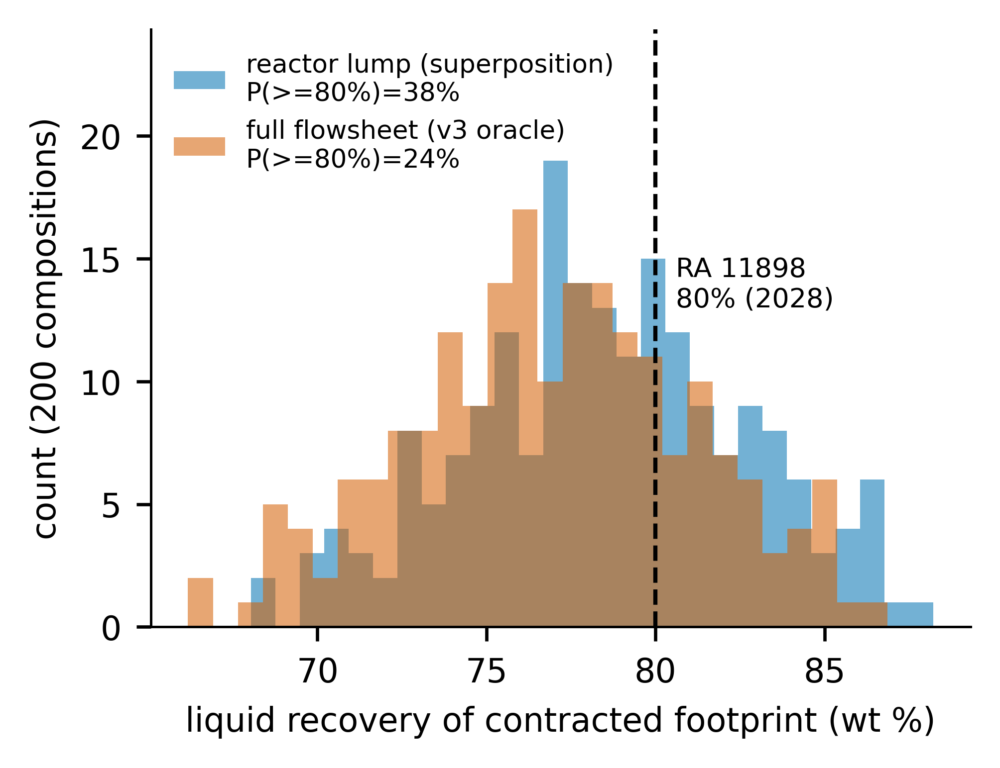
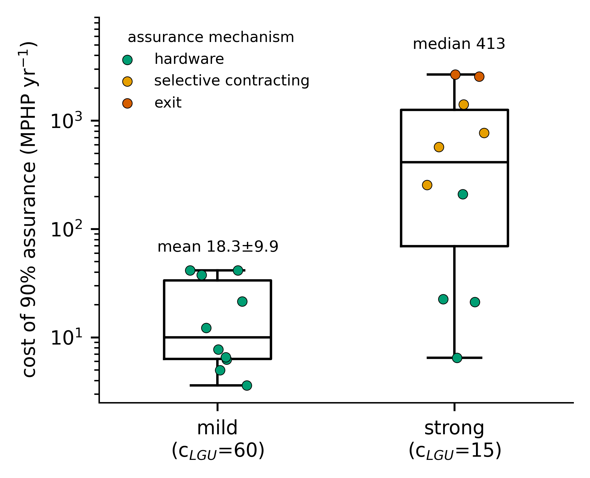
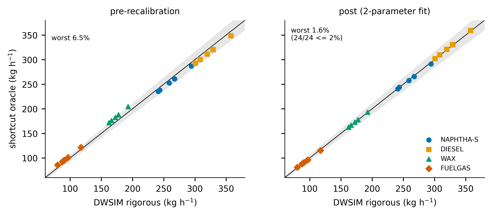
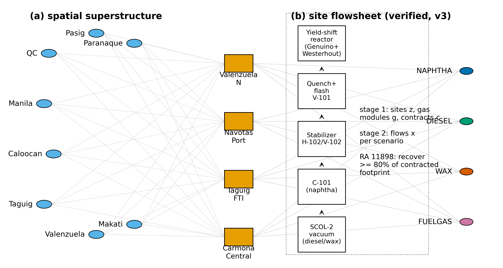
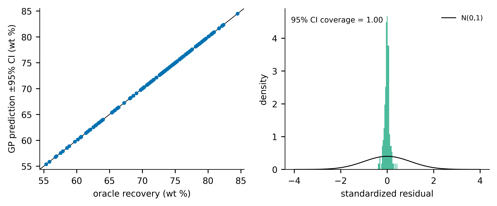
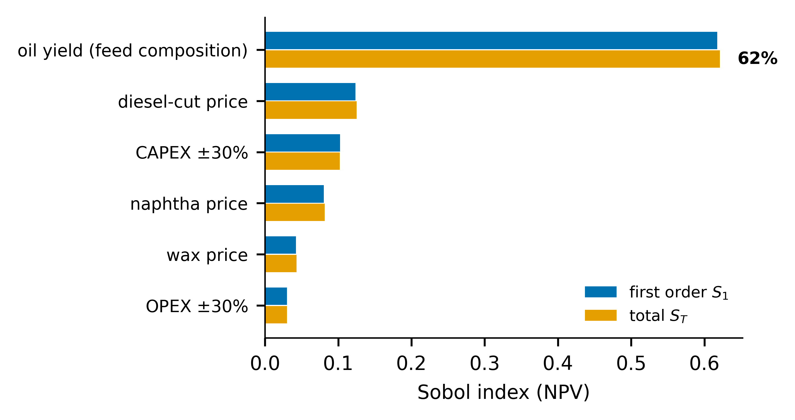

# Chance-constrained design of decentralized plastic-pyrolysis networks under feedstock-composition uncertainty

[](https://doi.org/10.5281/zenodo.21317616)
[](LICENSE)
[](https://www.python.org/)
[](#paper-status)

An EPR-compliance study of mixed-plastic pyrolysis networks in the Philippines. Every number and every figure in the paper regenerates from this repository.

---

## Paper status

| | |
|---|---|
| **Manuscript** | Chance-constrained design of decentralized plastic-pyrolysis networks under feedstock-composition uncertainty: an EPR-compliance study for the Philippines |
| **Journal** | *Computers & Chemical Engineering* (Elsevier) |
| **Manuscript no.** | `CACE-D-26-01165` |
| **Status** | 🟠 **Submitted, under editorial consideration** (13 July 2026) |
| **Author** | Bien Busico ([ORCID 0009-0006-7755-2470](https://orcid.org/0009-0006-7755-2470)) |
| **Archive** | [10.5281/zenodo.21317616](https://doi.org/10.5281/zenodo.21317616) (concept DOI, always resolves to latest) |

---

## The question

The Philippine Extended Producer Responsibility Act (RA 11898) obliges large enterprises to recover **80% of their plastic-packaging footprint from 2028**. The residual waste stream is dominated by multilayer sachets and film, which mechanical recycling cannot process and whose composition **has never been measured at the locality level**.

*At what scale and configuration can a pyrolysis network satisfy that obligation, at acceptable cost, when the feedstock composition is uncertain?*

## Four findings

| # | Finding | Number |
|---|---|---|
| 1 | **Compliance is chemistry-bound.** A network processing its entire contracted footprint meets the 80% obligation in a minority of scenarios, and *no siting decision changes this*. One gas-energy-recovery module does. | 24–30% → **80%** |
| 2 | **The value of the stochastic solution is zero** — fines sit two orders of magnitude below margins. The decision-relevant quantity is the **cost of compliance assurance**. | VSS ≈ 0 |
| 3 | **Deterministic designs over-promise compliance.** | **25–30 pp** |
| 4 | **Feedstock composition dominates the economics** — more than all prices and capital uncertainty combined. | Sobol **S<sub>T</sub> = 0.62** |

Both the compliance analysis and the economics point at the same missing dataset: **resin-resolved waste characterization**.

---

## Figures

<p align="center"><br>
<em>Compliance risk. Each layer of process fidelity makes the 80% obligation harder, not easier.</em></p>

<p align="center"><br>
<em>The study's central design quantity: the cost of guaranteeing 90% compliance — and the mechanism switch from hardware hedging to selective contracting as spatial heterogeneity grows.</em></p>

<p align="center"><br>
<em>Validation. The reduced-order oracle against six rigorous DWSIM simulations, before and after a two-parameter mechanistic recalibration. 24/24 cells within 2%.</em></p>

<details>
<summary><b>Remaining figures (F1 superstructure, F4 GP calibration, F6 Sobol)</b></summary>
<p align="center">
<br>
<br>

</p>
</details>

---

## Reproduce everything

```bash
git clone https://github.com/beebzy-droid/ipis-thesis-pyrolysis-epr
cd ipis-thesis-pyrolysis-epr
pip install -r requirements.txt

cd src
python verify_vs_genuino.py       # V3: yield model vs experiment      -> 4.6 pp (pass, tol 5)
python verify_vs_dwsim.py         # oracle vs 6 DWSIM runs + LOOCV     -> 24/24 within 2%
python feedstock_doe.py           # composition uncertainty set + DOE
python surrogate_train.py         # GP + LightGBM  (95% CI coverage 0.99-1.00)
python superstructure_p4b.py      # stochastic + chance-constrained superstructure
python saa_stability.py batch mild 0 10   # SAA replications (also: strong, aggregate, benchmark)
python tea_uq.py                  # TEA + Sobol + LCA
python figures/make_figures.py    # regenerates all six paper figures
```

Runtime: minutes for the process models; the SAA study is the long pole (~30 min for 40 MILPs on HiGHS).

**The DWSIM flowsheet** (`models/pyrolysis_base_v3.dwxmz`) opens in [DWSIM](https://dwsim.org) — free, open-source. `models/dwsim_build_guide.md` rebuilds it from scratch, step by step.

---

## Repository map

```
src/          reproducible source — every number in the paper traces to a script here
  lumped_kinetics.py       Genuino superposition yields + Westerhout kinetics
  verify_vs_genuino.py     V3 verification against independent mixture experiments
  flowsheet_shortcut.py    reduced-order oracle (DWSIM-calibrated)
  verify_vs_dwsim.py       6-point validation + 2-parameter recalibration + LOOCV
  feedstock_doe.py         composition uncertainty set (Dirichlet + robust box) & LHS DOE
  surrogate_train.py       Gaussian-process + LightGBM surrogates
  superstructure_opt.py    two-stage stochastic superstructure (Pyomo/HiGHS)
  superstructure_p4b.py    four-lever model + chance constraints
  saa_stability.py         SAA replication study + deterministic benchmark
  tea_uq.py                TEA, Sobol sensitivity, streamlined LCA
  cut_split_uncertainty.py declared-uncertainty treatment of the oil cut split
  figures/make_figures.py  regenerates all six figures

models/       DWSIM flowsheet (.dwxmz) + build guide, spec, validation protocol, energy audit
results/      findings, validation reports, TEA, and the published figures
literature/   annotated bibliography (28 refs), gap matrix, reframing memo
docs/         manuscript, submission package, adversarial review, DAO 2023-02 legal read
data/         public sources only — no proprietary plant data
```

## Method in one line

Genuino superposition yields (verified to 4.6 pp) → DWSIM flowsheet (mass balance 0.0014%) → reduced-order oracle (validated 24/24 within 2%) → Gaussian-process surrogate (95% CI coverage 0.99) → **embedded *exactly*** in a two-stage stochastic spatial superstructure under the RA 11898 footprint obligation, solved risk-neutral and chance-constrained.

The surrogate embedding is exact, not approximate: superposition is linear in composition, so per-source scenario coefficients carry **no blending error** into the network program.

## Notable

- **VSS = 0 is reported as a finding, not buried.** Section 3.2 explains why, and argues it generalizes to profit-dominant valorization networks under compliance obligations.
- **A prediction was falsified and reported.** The pre-registered failure mode for the oracle (extrapolation at high gas make) was wrong; the real errors were systematic biases with identifiable mechanisms. Section 2.4.
- **A model artifact was self-reported.** The replication study found the chance constraint could be satisfied by contracting *zero* footprint. Section 3.5.
- **The regulatory claims are read from primary text**, not summaries. See `docs/dao_2023-02_legal_read.md`.

## Citation

```bibtex
@software{busico_ipis_pyrolysis_epr,
  author  = {Busico, Bien},
  title   = {ipis-thesis-pyrolysis-epr: chance-constrained design of decentralized
             plastic-pyrolysis networks under feedstock-composition uncertainty},
  year    = {2026},
  doi     = {10.5281/zenodo.21317616},
  url     = {https://github.com/beebzy-droid/ipis-thesis-pyrolysis-epr}
}
```

## Licence

MIT — see [LICENSE](LICENSE). Data sources are public (World Bank, DENR, peer-reviewed literature); no proprietary plant data is included.
